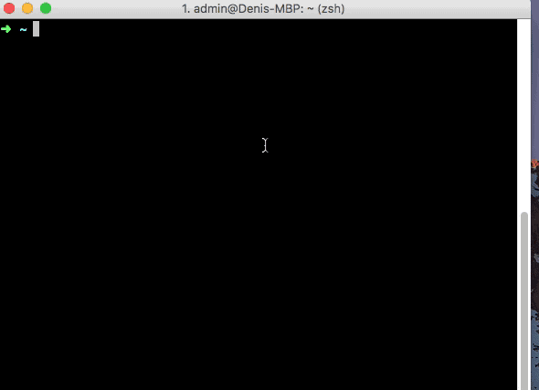

# dt-jokes

A cli to fetch jokes. Will implement other sources, but currently fetches from `reddit.com/r/dadjokes`

### Installation

    npm install -g jokes-cli 
    jokes 
    // -> will return top three jokes 

### TODO: Feature improvements
- [ ] tests  
- [ ] pagination  
- [ ] 'state' to remember if a joke has been repeated today  
- [ ] other sources

### Author
Denis Tsoi <denistsoi@gmail.com>

### License
MIT